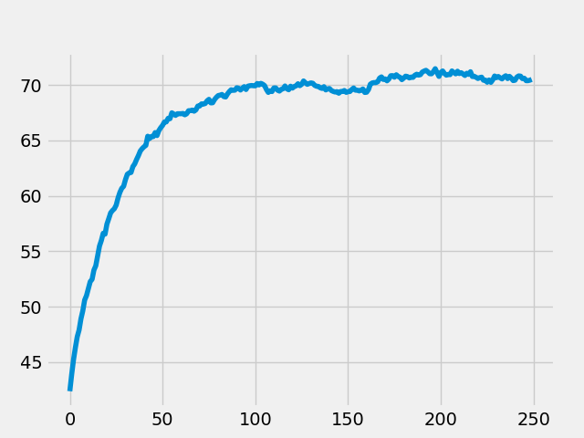

# Problema da Mochila

> Problema da mochila resolvida atravéz de algoritimo genético utilizando python.

## Parâmetros
- N º de Gerações: 250
- Número de selecionados: 700
- Forma de Seleção: Roleta
- Porcentagem de crossover: 80% dos selecionados
- Taxa de mutação: 3%

## Fitness
O fitness de cada bolsa é a soma de todos os valores dos itens dentro dela, mas caso ocorra de alguma bolsa ultrapassar o valor de peso/volume máximo será descontado do valor 1% a cada ponto ultrapassado. EX:
- Peso: 127  Volume: 120 Valor: 145
- Como o peso ultrapassa 125 fazemos: 127 – 125 = 2%
- Fitness = 145 – 2% = 142.1

## Resultados
Melhor Bolsa encontrada
- fitness:143.0, Itens:[1, 1, 1, 1, 1, 1, 1, 0, 1, 0, 1, 1, 1, 1, 1, 1, 1, 1, 0, 1, 1, 1, 1, 1, 1] Valor/Peso/Volume: 143.0/122/123

## Grafico de evolução
 Grafico que representa a média de fitness da população ao longo das gerações

